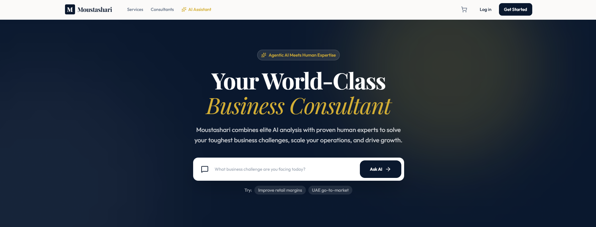
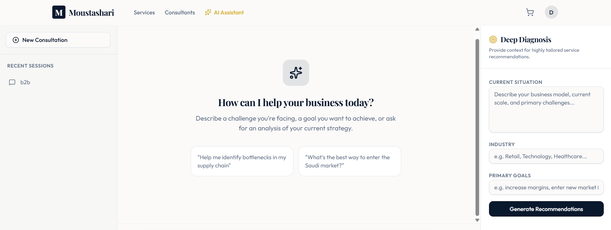
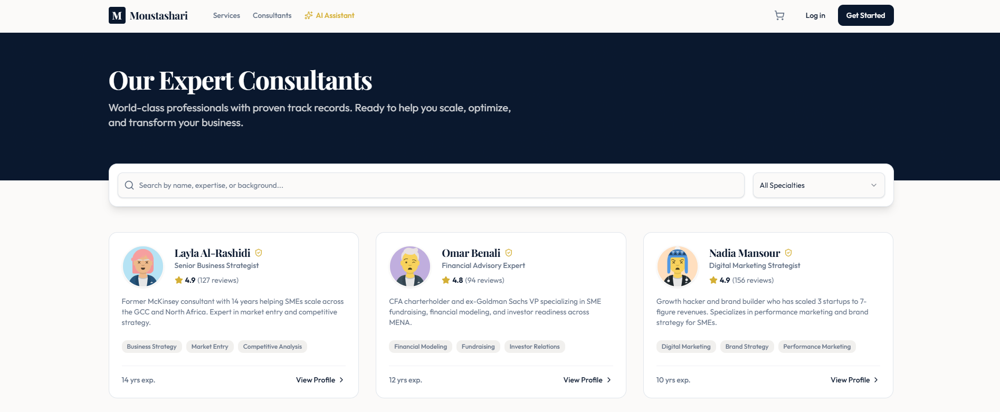

# Moustashari AI — AI Business Consulting Platform

---

## Project Name

**Moustashari AI**
*(مستشاري — Arabic for "my consultant")*

---

## One-line Elevator Pitch (max 25 words)

An AI-guided marketplace that turns a plain-language description of a business problem into ranked, matched consultants and services for SMEs.

---

## Short Description (50–100 words)

Moustashari AI is a full-stack consulting marketplace built for small and medium businesses. Instead of browsing an unstructured catalog of consultants, users describe their business challenge to an AI assistant, which classifies the problem (marketing, finance, legal, technology, strategy, or HR) and returns tailored advice plus a shortlist of matching services and consultants. The platform also includes a searchable consultant directory, a full service catalog with reviews, a shopping cart, and account authentication — all built on a type-safe, monorepo TypeScript stack with PostgreSQL persistence.

---

## Screenshots

### Home / Hero

### Platform Preview

---

## Detailed Description (200–300 words)

SMEs frequently know they need outside expertise but don't know what *kind* of consultant to look for, or where a general marketplace listing should even begin. Moustashari AI removes that friction by putting a conversational assistant at the front door of the marketplace.

A user types a description of their situation — for example, a question about funding, hiring, or digital marketing — into the AI Assistant chat. The backend classifies the message against a curated set of business-domain rules, returns a consultative reply, and cross-references the platform's service catalog by topic tags to recommend up to three relevant services. Every conversation is persisted as a chat session, so users can return to prior conversations.

Beyond the chat, a dedicated recommendations engine accepts a more structured intake — business description, industry, goals, and budget — and scores every service in the catalog using tag relevance, a "featured" boost, and consultant rating, returning the top six matches with a plain-language explanation of the reasoning.

Around this AI core sits a complete marketplace experience: a browsable and filterable service catalog, consultant profile pages with bios, specializations, and reviews, a shopping cart that works for both signed-in and anonymous visitors, and email/password authentication with token-based sessions.

The system is built as a pnpm monorepo with a single OpenAPI specification as the source of truth, from which a type-safe React Query client and Zod validation schemas are automatically generated — ensuring the frontend and backend never drift out of sync.

---

## Problem Statement

Small and medium-sized businesses often need professional consulting help but lack the internal expertise to know exactly which discipline (marketing, finance, legal, technology, strategy, or HR) will solve their problem, or how to translate a vague business pain point into the right search filters on a traditional marketplace. This mismatch leads to wasted time, missed opportunities, and underuse of available consulting talent.

---

## Solution

Moustashari AI puts a conversational assistant in front of the marketplace. Users describe their problem in natural language; the platform classifies the underlying need and immediately surfaces relevant consulting services and consultants, alongside a written explanation of the recommendation. A structured recommendations form (industry, goals, budget) offers the same matching logic for users who prefer not to chat. From there, the existing marketplace — consultant profiles, service details, reviews, and a cart — carries the user through to a purchase decision.

---

## Target Users

- **SME owners and founders** who need consulting help but aren't sure which specialty to search for
- **Early-stage and growing businesses** evaluating funding, marketing, legal, technology, or hiring decisions
- **Consultants** whose profiles, specializations, and services are showcased and discovered through the platform
- **Marketplace buyers** who want to compare, review, and purchase consulting engagements in one place

---

## Key Features

- 🏠 Home page with platform statistics, featured services, and categories
- 💬 AI Assistant chat with persistent, retrievable conversation history
- 🎯 Structured recommendations engine (industry, goals, budget → ranked services)
- 🧑‍💼 Searchable consultant directory (name, title, bio search)
- 👤 Consultant profile pages with bio, education, languages, services, and reviews
- 🗂️ Service catalog with category, price-range, and keyword filtering
- ⭐ Featured services surfaced on the home page
- 📄 Service detail pages with long descriptions, deliverables, FAQs, and reviews
- 🛒 Shopping cart supporting both authenticated and anonymous sessions
- 🔐 Email/password authentication with token-based sessions
- 📊 Platform statistics endpoint (consultants, services, average rating)
- 🩺 Health check endpoint for uptime monitoring

---

## AI Features

The AI Assistant is powered by two backend engines:

1. **Conversational classification (`/api/chat/message`)** — Incoming messages are matched against curated keyword sets across six business domains (marketing, finance, legal, technology, strategy, HR). A matching domain returns a written consulting response and a set of topic tags; the tags are used to query the service catalog and attach up to three relevant service recommendations to the reply. If no domain matches, the assistant asks a clarifying follow-up rather than failing silently. All messages and sessions are persisted so conversations can be resumed.

2. **Structured recommendation scoring (`/api/recommendations`)** — Given an industry, a list of goals, an optional budget, and a free-text business description, the engine builds a relevance tag set from industry/goal mappings and keyword extraction from the description, filters services by budget, and scores every remaining service by **tag overlap + a featured-listing bonus + its star rating**. The top six services are returned with a natural-language explanation of why they were selected.

Both engines run entirely in-process on the Node.js backend with no external LLM API dependency, making the system fully self-contained and deterministic for demo purposes, while being designed so the same endpoints could be backed by a real LLM in the future.

---

## Technologies Used

| Layer | Technologies |
|---|---|
| Frontend | React 19, TypeScript, Vite 7, Tailwind CSS 4, Wouter, TanStack React Query, Radix UI / shadcn-style components, React Hook Form + Zod, Framer Motion, Recharts |
| Backend | Node.js 24, Express 5, Pino / pino-http |
| Database | PostgreSQL, Drizzle ORM, drizzle-zod |
| API Contract | OpenAPI 3.1 spec, Orval-generated typed client and Zod schemas |
| Auth | Custom token-based sessions, salted SHA-256 password hashing |
| Tooling | pnpm workspaces, TypeScript project references, esbuild |
| Deployment | Replit (Node.js 24 + PostgreSQL 16, autoscale) |

---

## Architecture Overview

Moustashari AI is a **pnpm monorepo** with a clear separation between contract, backend, and frontend:

- **`lib/api-spec`** holds a single OpenAPI 3.1 specification that acts as the source of truth for every API endpoint.
- **`lib/api-client-react`** and **`lib/api-zod`** are generated from that spec via Orval, producing a type-safe React Query client and Zod validation schemas — so the frontend and backend contracts cannot silently drift apart.
- **`lib/db`** defines the PostgreSQL schema with Drizzle ORM (`users`, `sessions`, `consultants`, `services`, `categories`, `reviews`, `chat_sessions`, `chat_messages`, `cart_items`) and exposes a single database client.
- **`artifacts/api-server`** is an Express 5 application exposing REST routes under `/api` for auth, categories, services, consultants, chat, cart, recommendations, and health checks, with Pino-based structured logging.
- **`artifacts/moustashari`** is the React 19 + Vite single-page application, using Wouter for routing, TanStack Query for data fetching through the generated client, and a Tailwind/Radix component system for the UI.

Authentication uses custom bearer tokens (not JWT): a random 256-bit token is stored server-side in a `sessions` table with a 7-day expiry, checked on each request via an `Authorization: Bearer` header. The shopping cart supports both authenticated users (`user_<id>` session key) and anonymous visitors (a client-supplied `x-cart-session` header), so unauthenticated visitors can still shop before creating an account.

---

## Innovation

Rather than building "yet another consultant directory," Moustashari AI reframes discovery as a conversation. The chat assistant and the structured recommendation engine share the same underlying tag-matching philosophy but serve two different user preferences — free-form chat vs. structured form input — while both write into the same service catalog and scoring logic, avoiding duplicated business rules. The platform also demonstrates a **contract-first development approach**: the OpenAPI specification generates both the validation layer (Zod) and the frontend data-fetching layer (React Query hooks), which is a production-grade practice not commonly seen in hackathon-scale projects.

---

## Business Value

- **Reduces discovery friction** for SME buyers, which can shorten the path from "I have a problem" to "I've booked a consultant."
- **Increases conversion for consultants** by surfacing their services to users whose stated needs match their tags, rather than relying on generic browsing.
- **Reusable recommendation logic** (tag scoring + featured/rating weighting) can be extended to any consulting or services marketplace vertical.
- **Type-safe, contract-first architecture** reduces integration bugs between frontend and backend, lowering long-term maintenance cost — an attractive trait for a platform intended to scale past a hackathon prototype.

---

## Future Improvements

- Integrate a real large-language-model provider behind the existing `/chat` and `/recommendations` endpoints to replace keyword matching with genuine natural-language understanding
- Add real payment processing to the shopping cart / checkout flow
- Replace SHA-256 password hashing with a dedicated algorithm (bcrypt/argon2) and move bearer tokens to HTTP-only cookies
- Add consultant booking and calendar availability
- Add internationalization (Arabic/English), given the platform's naming and target market
- Replace the static placeholder client count in `/api/stats` with a real, database-derived metric
- Add automated test coverage across API routes
- Add real-time updates (e.g., WebSockets) for chat responses and order status

---

## Challenges Faced

- **Designing a matching algorithm without an external AI dependency**: building a deterministic, keyword- and tag-based classification and scoring system that still feels conversational and relevant, while keeping the demo fully self-contained.
- **Unifying authenticated and anonymous shopping experiences**: the cart had to work identically for logged-in users (session tied to their account) and anonymous visitors (session tied to a client-generated header), without duplicating cart logic.
- **Keeping the frontend and backend contracts in sync**: adopting an OpenAPI-first workflow with generated clients and schemas added upfront tooling complexity but eliminated an entire class of integration bugs between the Express API and the React frontend.
- **Coordinating a multi-package monorepo**: structuring shared database, API-contract, and generated-client packages (`lib/db`, `lib/api-spec`, `lib/api-client-react`, `lib/api-zod`) so both the API server and frontend consume the same types.

---

## What Makes This Project Unique

- The AI assistant and the structured recommendation form are two entry points into a **single shared scoring engine**, rather than two disconnected features.
- The project uses a **contract-first, type-safe pipeline** (OpenAPI → Orval → Zod + React Query) that is unusually rigorous for a hackathon timeline.
- The cart and session design deliberately support **both anonymous and authenticated shopping**, reflecting real e-commerce UX rather than a demo-only login-gated flow.
- Chat conversations are **persisted and resumable**, not ephemeral, giving the assistant a memory of past sessions per user.

---

## Why This Project Should Win

Moustashari AI solves a real, well-scoped problem — matching SMEs to the right consulting expertise — with a working, end-to-end implementation: authentication, a full service/consultant marketplace, a persistent AI chat assistant, a scoring-based recommendation engine, and a cart, all backed by a properly normalized PostgreSQL schema and a type-safe API contract. It demonstrates both product thinking (structuring the AI around actual buyer intent) and engineering discipline (contract-first codegen, session-aware persistence, anonymous-and-authenticated parity) that go beyond a typical hackathon prototype.

---

## Demo Script (under 2 minutes)

**00:00–00:10**
"This is Moustashari AI — an AI-guided consulting marketplace that helps small businesses find the right expert, fast."

**00:10–00:30**
"Here's the home page: featured services, categories, and platform stats. Most marketplaces stop here and expect you to browse. I designed the experience to start with a conversation rather than browsing alone."

**00:30–00:50**
*(Open the AI Assistant chat, type a message like "I need help with digital marketing for my startup.")*
"I'll describe my business challenge in plain language. The assistant classifies it, gives consulting advice, and — right here — recommends matching services from the platform catalog automatically."

**00:50–01:10**
*(Navigate to a recommended service, then to the consultant's profile.)*
"From the recommendation, I can view the full service details — deliverables, FAQs, reviews — and the consultant's profile, with their ratings, specializations, and experience."

**01:10–01:30**
*(Add the service to the cart.)*
"I add it to my cart — this works whether I'm logged in or just browsing anonymously — and I'm ready to check out. That's the full loop: describe a problem, get matched, and take action, all in one flow."

---

## Presentation Script

*(Professional 2-minute script for judges)*

"Small and medium businesses often know they need outside help, but they don't know what *kind* of help to look for. A typical consulting marketplace expects them to already know the answer — to pick a category, a filter, a search term. Moustashari AI starts one step earlier: with a conversation.

Moustashari AI is a full-stack consulting marketplace. At its center is an AI Assistant that takes a plain-language description of a business problem, classifies it across six domains — marketing, finance, legal, technology, strategy, and HR — and responds with consulting guidance plus a shortlist of matching services pulled live from our catalog. For users who prefer structure over conversation, the platform also offers a recommendations engine that takes an industry, a set of goals, and a budget, and scores every service in the catalog by relevance, rating, and featured status to return the best six matches with an explanation.

Around that intelligence layer, I built a complete marketplace: a searchable consultant directory with verified profiles and reviews, a filterable service catalog, a shopping cart that works for both anonymous visitors and signed-in users, and token-based authentication.

On the engineering side, I treated this as production-style software rather than a throwaway demo. I used an OpenAPI specification as the single source of truth for the API and generated a type-safe React Query client and Zod validation schemas directly from it — helping keep the frontend and backend contracts aligned. Everything is backed by a normalized PostgreSQL schema managed with Drizzle ORM, running in a pnpm monorepo.

The result is a working, end-to-end product: describe a problem, get matched to the right expertise, review the consultant, and add their service to your cart — all in one continuous flow. Thank you."

---

## GitHub Description

*(Short repository description, ~150 characters)*

AI-guided consulting marketplace connecting SMEs with matched consultants via a conversational assistant and a tag-based recommendation engine.

---

## LinkedIn Post

🧭 Excited to share **Moustashari AI** — a project I built for [Hackathon Name], an AI-guided consulting marketplace for small and medium businesses.

The core idea: instead of making SME owners guess which type of consultant they need, Moustashari AI lets them describe their business challenge in plain language. An AI Assistant classifies the problem across six domains (marketing, finance, legal, technology, strategy, HR), gives consulting advice, and recommends matching services from a live catalog — backed by a scoring engine that also powers a structured recommendations form (industry, goals, budget).

On top of that intelligence layer sits a full marketplace experience: a searchable consultant directory, detailed service pages with reviews and FAQs, a cart that supports both anonymous and signed-in shopping, and token-based authentication.

Technically, I'm proud of the contract-first architecture: a single OpenAPI spec generates a type-safe React Query client and Zod schemas for the whole stack, built on React 19, Express 5, PostgreSQL, and Drizzle ORM inside a pnpm monorepo.

Would love feedback from the community — check it out below! 👇

#AI #Hackathon #Startup #FullStack #TypeScript #React #PostgreSQL #ConsultingMarketplace

---

## Project Tags (10–15)

`AI Assistant` `Consulting Marketplace` `SME Tech` `Recommendation Engine` `Full-Stack` `React` `TypeScript` `Express` `PostgreSQL` `Drizzle ORM` `OpenAPI` `Monorepo` `Chatbot` `B2B SaaS` `Marketplace Platform`

---

## Resume Project Description

*(3 professional bullet points)*

- Designed and built **Moustashari AI**, a full-stack consulting marketplace connecting SMEs with consultants, using React 19, Express 5, PostgreSQL, and Drizzle ORM in a pnpm monorepo.
- Implemented an AI Assistant chat and a tag-based recommendation engine that classify natural-language business problems and score a service catalog by relevance, rating, and featured status to return personalized matches.
- Architected a contract-first API layer using OpenAPI 3.1 with Orval code generation, producing a type-safe React Query client and Zod validation schemas shared across frontend and backend to eliminate integration drift.

---

## Portfolio Description

Moustashari AI is a full-stack AI-guided consulting marketplace that helps small and medium businesses find the right consultant without needing to know which specialty to search for. Users chat with an AI Assistant that classifies their business challenge and recommends matching services and consultants; a structured recommendations form offers the same matching logic through industry, goals, and budget inputs. The platform includes a full consultant directory, service catalog, shopping cart (for both anonymous and authenticated users), and account authentication, built on React 19, Express 5, and PostgreSQL with a contract-first, type-safe API layer generated from a single OpenAPI specification.

---

## FAQ

**Q: Does the AI Assistant use a large language model like GPT or Claude?**
A: No. In the current implementation, the assistant uses a deterministic keyword-matching and tag-scoring engine written in TypeScript, running entirely on the backend with no external AI API calls. This keeps the demo self-contained and predictable. The same endpoints are designed so a real LLM could be dropped in behind them in the future.

**Q: How does the recommendation engine decide which services to show?**
A: It builds a set of relevant tags from the selected industry, the selected goals, and keywords found in the free-text business description, then scores every service in the catalog by tag overlap, a bonus for "featured" listings, and the service's star rating. Services are filtered by budget if one is provided, and the top six by score are returned.

**Q: How is user authentication handled?**
A: Users register and log in with email and password. Passwords are hashed with a salted SHA-256 hash, and a random 256-bit bearer token is issued and stored server-side in a `sessions` table with a 7-day expiry. The token is sent as an `Authorization: Bearer` header on subsequent requests.

**Q: Can someone use the shopping cart without creating an account?**
A: Yes. Anonymous visitors are tracked via a client-supplied `x-cart-session` header, while authenticated users are tracked by a session key derived from their user ID, so both flows share the same cart logic.

**Q: What database and ORM does the project use?**
A: PostgreSQL, accessed through Drizzle ORM. The schema includes tables for users, sessions, consultants, services, categories, reviews, chat sessions, chat messages, and cart items.

**Q: How do the frontend and backend stay in sync?**
A: The project follows a contract-first approach: a single OpenAPI 3.1 specification defines every endpoint, and the Orval tool generates a type-safe React Query client (`@workspace/api-client-react`) and Zod validation schemas (`@workspace/api-zod`) directly from that spec, so both sides of the stack consume the same generated types.

**Q: Is the chat history saved?**
A: Yes. Each conversation is stored as a chat session with an associated list of messages in PostgreSQL, so users can retrieve past conversations rather than losing them when the page reloads.

**Q: What would you build next if you had more time?**
A: The top priority would be replacing the keyword-based chat and recommendation logic with a real LLM integration, followed by adding payment processing to the checkout flow and consultant booking/scheduling.
